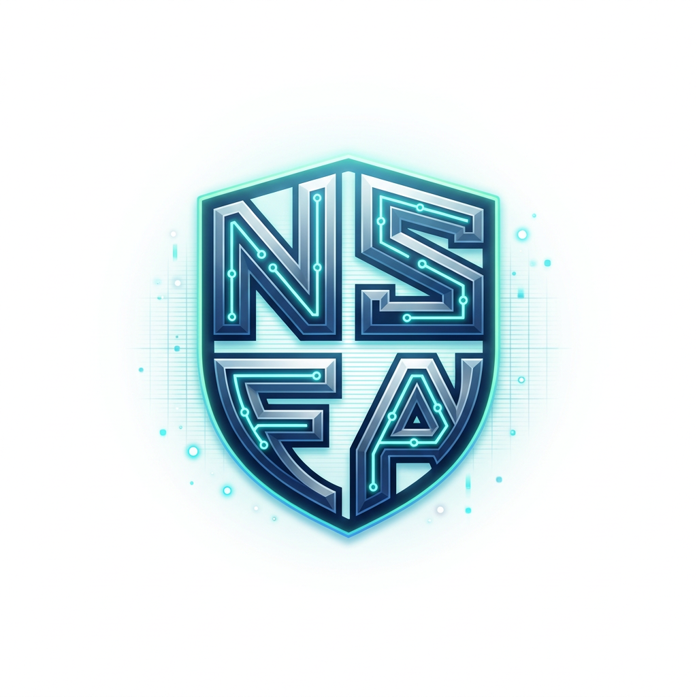
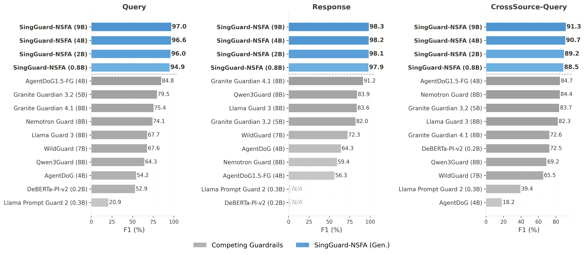
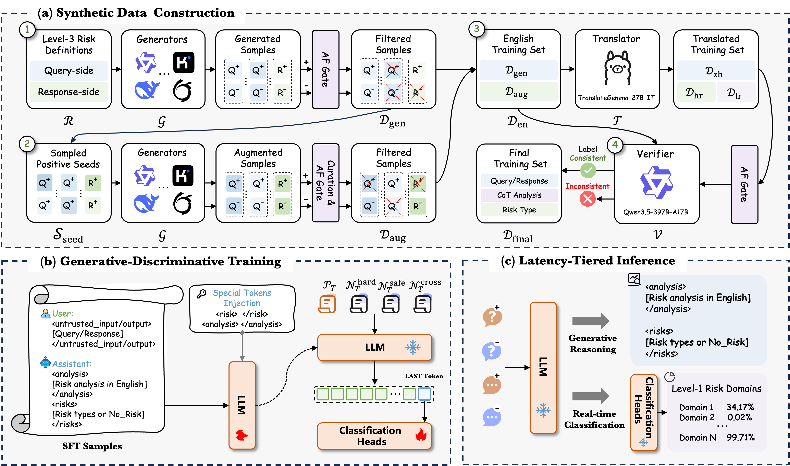
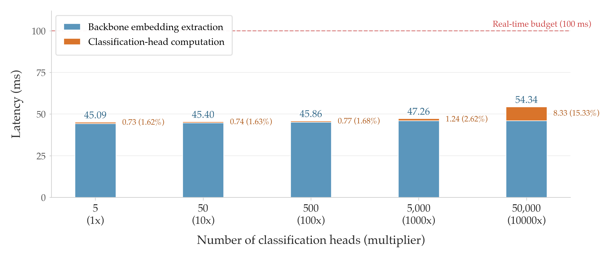
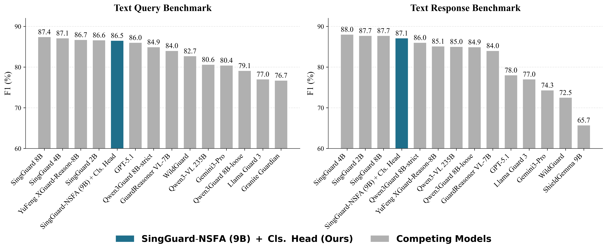

<div align="center">
  <br>
  <h1 style="margin-top: 0;">SingGuard-NSFA: Extensible Guardrails for Agentic AI<br>via Generative Reasoning and Real-Time Classification</h1>
</div>

<div align="center">

**SingGuard Team, AI Security Lab, Ant Group**

[-red.svg)](https://arxiv.org/abs/2606.22873)
[](https://huggingface.co/collections/inclusionAI/singguard-nsfa)
[](https://modelscope.cn/collections/inclusionAI/SingGuard-NSFA)

> **Note:** The paper is currently being uploaded to arXiv. The link may not be accessible yet.

</div>

---

As Large Language Models evolve from text generators into autonomous agents that invoke tools, execute code, and orchestrate multi-step plans, the security threat landscape has fundamentally shifted from _what a model says_ to _what an agent does_. Existing content-safety guardrails were never designed to detect operational threats such as prompt injection, sensitive information extraction, malicious code requests, dangerous tool misuse, and resource exhaustion.

**SingGuard-NSFA** is a guardrail framework that addresses this gap with the following contributions:

- **NSFA risk taxonomy** — a CIA-triad-grounded hierarchy of 185 risk variants across 7 Level-1 domains, cross-validated against three OWASP guidelines.
- **Multilingual benchmark suite** spanning 133 languages, with over 93K purpose-built samples and 3,435 cross-source samples.
- **Dual-mode inference** architecture — generative reasoning for interpretable offline auditing and discriminative classification heads for real-time online interception at ~50 ms.
- **Native extensibility** — extending detection to a new risk beyond the NSFA taxonomy requires only a lightweight classification head trained on the frozen backbone, with no retraining or disruption to existing capabilities. The same approach also works as a plug-in enhancement for other guardrails (e.g., +17.6 F1 points on Llama Guard 3).

We release **four models** (0.8B, 2B, 4B, 9B), all achieving **>94% F1** on purpose-built multilingual benchmarks and surpassing the strongest competing guardrails by **6-12 absolute F1 points**.

<p align="center">
  
</p>

<p align="center"><em>Binary detection F1 (%) on three multilingual benchmarks. SingGuard-NSFA (blue) consistently outperforms all competing guardrails (gray) across all model sizes.</em></p>

## NSFA Risk Taxonomy

SingGuard-NSFA detects both **query-side** (malicious user inputs) and **response-side** (harmful model outputs) threats, organized into 7 Level-1 domains, 28 Level-2 risks, and 185 Level-3 variants.

### Design Principles

- **Query-First, Response-as-Backstop** — Threats are intercepted at the earliest possible stage. The query guardrail serves as the primary defense; the response guardrail acts as a complementary backstop.
- **Single-Turn Detectability** — Only risks detectable from a single turn of text fall within scope, enabling the guardrail to operate as a stateless, low-latency module.
- **Multilingual Coverage** — The taxonomy and benchmarks provide comprehensive multilingual support to prevent non-English evasion.

### Seven Level-1 Domains

| Side | Domain | CIA | Description |
|:---:|:---:|:---:|:---|
| Query | **Prompt Injection & Jailbreak** | C, I, A | Adversarial input techniques that hijack agent behavior via injected instructions, context manipulation, or linguistic/encoding obfuscation. |
| Query | **Malicious Code & Cyberattack** | I | Requests for malware generation, exploit development, or cyberattack procedures such as privilege escalation and lateral movement. |
| Query | **Sensitive Information Stealing** | C | Attempts to extract confidential information such as system prompts, model internals, or personal and proprietary data. |
| Query | **Dangerous Operations & Tool Abuse** | I | Requests inducing privilege-escalating or destructive actions via tool misuse or tampered parameters. |
| Query | **Resource Abuse** | A | Requests triggering runaway execution or disproportionate computation, degrading service availability. |
| Response | **Hazardous Action Generation** | C, I, A | Responses furnishing actionable harmful content — dangerous commands, malicious code, or attack procedures. |
| Response | **Sensitive Information Leakage** | C | Responses exposing protected credentials, API keys, or secret keys in generated text. |

<p align="center">
  
  
</p>

<p align="center"><em>Left: Query-side risk taxonomy (5 domains, 24 risks, 160 variants). Right: Response-side risk taxonomy (2 domains, 4 risks, 25 variants).</em></p>

## Multilingual Benchmark Suite

| Benchmark | Total | Pos:Neg | #Domains | #Variants | Languages |
|:---|:---:|:---:|:---:|:---:|:---:|
| NSFA-Query-Multilingual | 63,431 | 29,474:33,957 | 5 | 160 | 133 |
| NSFA-Response-Multilingual | 29,972 | 14,314:15,658 | 2 | 25 | 133 |
| NSFA-CrossSource-Query | 3,435 | 2,315:1,120 | 5 | -- | 133 |

The cross-source benchmark is adapted from five public agent-security datasets (AgentDojo, InjecAgent, AgentHarm, AgentDyn, ATBench), providing independent validation of cross-source generalization.

## Framework Overview

<p align="center">
  
</p>

SingGuard-NSFA comprises three tightly integrated components:

### 1. Synthetic Data Construction

A four-stage pipeline leveraging **74 open-source LLMs** produces diverse, multilingual training data covering all 185 NSFA risk variants:

- **Stage 1 — Seed-Free Generation**: Each generator is prompted with risk definitions to produce positive-negative pairs without any seed data.
- **Stage 2 — Seed-Based Augmentation**: Positive samples from Stage 1 serve as seeds for a second round of generation, expanding distributional coverage.
- **Stage 3 — Multilingual Expansion**: English data is translated via TranslateGemma-27B-IT into Chinese (full coverage) and 131 additional languages (11 high-resource and 120 low-resource), covering 133 languages in total.
- **Stage 4 — Final Verification**: A stronger model (Qwen3.5-397B-A17B) independently re-annotates all samples; disagreements are discarded.

### 2. Generative-Discriminative Training

- **Phase 1 — Chain-of-Thought SFT**: The backbone (Qwen3.5-Base, 0.8B / 2B / 4B / 9B) is fine-tuned on formatted risk analysis data with explicit boundary tags (`<untrusted_input>` / `<untrusted_output>`) to prevent instruction injection during analysis.
- **Phase 2 — Extensible Head Training**: Lightweight per-domain MLP classification heads are trained on the frozen SFT model's last-token embeddings. Each head operates independently, enabling multi-label detection and native extensibility.

### 3. Latency-Tiered Inference

- **Generative Reasoning** — Autoregressively produces a chain-of-thought analysis grounded in NSFA definitions, followed by structured risk domain judgment, providing interpretability for compliance auditing and human review.
- **Real-Time Classification** — A single forward pass through the frozen backbone feeds last-token embeddings to all per-domain heads in parallel. No token generation required: **45-57 ms per sample**.

## Available Models & Benchmarks

| Resource | Parameters | Base Model | Download |
|:---:|:---:|:---:|:---:|
| SingGuard-NSFA-0.8B | 0.8B | Qwen3.5-0.8B | [](https://huggingface.co/inclusionAI/SingGuard-NSFA-0.8B) [](https://modelscope.cn/models/inclusionAI/SingGuard-NSFA-0.8B) |
| SingGuard-NSFA-2B | 2B | Qwen3.5-2B | [](https://huggingface.co/inclusionAI/SingGuard-NSFA-2B) [](https://modelscope.cn/models/inclusionAI/SingGuard-NSFA-2B) |
| SingGuard-NSFA-4B | 4B | Qwen3.5-4B | [](https://huggingface.co/inclusionAI/SingGuard-NSFA-4B) [](https://modelscope.cn/models/inclusionAI/SingGuard-NSFA-4B) |
| SingGuard-NSFA-9B | 9B | Qwen3.5-9B | [](https://huggingface.co/inclusionAI/SingGuard-NSFA-9B) [](https://modelscope.cn/models/inclusionAI/SingGuard-NSFA-9B) |
| SingGuard-NSFA-Benchmark | — | — | Coming Soon |

All variants support both **generative reasoning** and **real-time classification** modes.

## Performance

As shown in the figure above, all four SingGuard-NSFA models consistently outperform the best competing guardrails by **6-12 absolute F1 points** on all three multilingual benchmarks, while maintaining real-time inference latency of **45-57 ms** per sample in classification mode.

### Classification-Head Scalability

<p align="center">
  
</p>

Scaling the number of heads from 5 to 50,000 increases end-to-end latency by only **9 ms** (45.09 ms -> 54.34 ms), remaining well within the 100 ms real-time budget. The architecture scales to a large number of risks at negligible latency cost.

### Extensibility: New Risk Types via Lightweight Heads

A content safety head trained on the SingGuard-NSFA 9B backbone achieves F1 within 1 point of the best-performing dedicated content safety models on Text Query and Text Response benchmarks, outperforming Llama Guard 3, WildGuard, and GPT-5.1.

<p align="center">
  
</p>

### Extensibility: Plug-in Enhancement for Other Guardrails

Classification heads trained on the NSFA data can augment other guardrail models. When applied to **Llama Guard 3** (8B, the most widely downloaded content safety guardrail):

| Model | Mode | Query F1 | Response F1 | CrossSource-Query F1 |
|:---|:---:|:---:|:---:|:---:|
| Llama Guard 3 (original) | Gen. | 67.66 | 83.61 | 82.28 |
| Llama Guard 3 + NSFA Heads | +Cls. | **85.23** (+17.6) | **92.44** (+8.8) | **85.26** (+3.0) |

The augmented Llama Guard 3 surpasses all competing guardrails, ranking second only to SingGuard-NSFA.

## Citation

If you find SingGuard-NSFA helpful, please cite our work:

```bibtex
@article{singguard2026nsfa,
  title     = {SingGuard-NSFA: Extensible Guardrails for Agentic AI via Generative Reasoning and Real-Time Classification},
  author    = {Li, Hongcheng and Yi, Sibo and Liao, Bingyan and Fu, Kaiwen and Xiong, Run and Wu, Chen and Yin, Shenglin and Li, Zongyi and Bai, Yichen and He, Liangbo and Lan, Jun and Cui, Shiwen and Meng, Changhua and Wang, Weiqiang},
  year      = {2026}
}
```